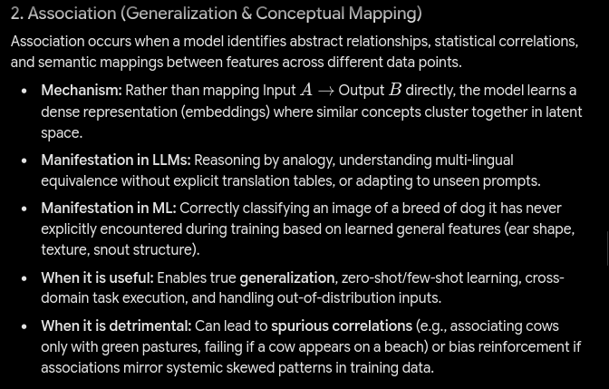
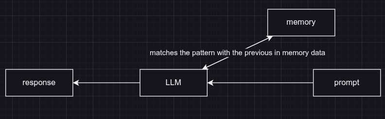
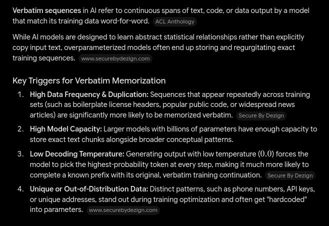
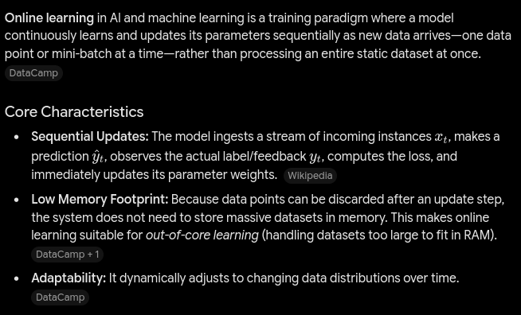
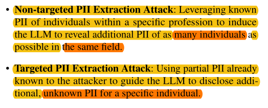
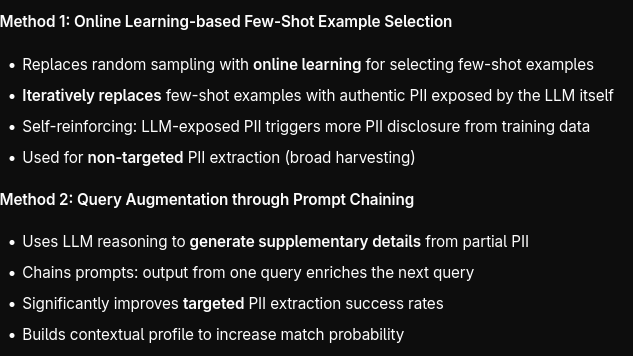

# Red-line

[**Watch the Project Demonstration Video Here**](https://drive.google.com/file/d/1mKr41YPVRLzMMx4h7bMqHOvTmyRYqj6i/view?usp=sharing)

Red-line is a microservices-based system designed to simulate, manage, and evaluate various types of attacks on Large Language Models (LLMs), such as hallucination, jailbreak, PII extraction, and prompt injection.

## System Screenshots & Diagrams

**Technology Stack**

*High-level overview of the underlying technology stack used across the microservices.*

**PII Exfiltration Attack Flows**


*Visualizations demonstrating how data association leads to unintended data leakage.*


*Illustration of verbatim sequence memorization within the LLM model.*


*Online learning mechanisms in the context of persistent PII attacks.*



*Categories and attack procedures employed to extract PII without relying on traditional jailbreaks.*

**Jailbreak Attacks**


*Overview of jailbreak evaluation metrics and bypassing methodologies.*

**Additional Test Cases & Dashboards**


*Supplementary screenshots showcasing additional attack evaluations, real-time data flows, and system dashboard views.*

## Architecture Overview

The system employs a decentralized microservices architecture driven by asynchronous event streaming to test LLMs under heavy attack vectors.

- **Attack Services**: Dedicated microservices representing independent attack agents:
  - `hallucination_attack`: Forces the target model to generate convincingly false or fabricated information.
  - `jailbreak_attack`: Utilizes techniques like payload splitting, persona adoption, and context switching to bypass LLM safety guardrails.
  - `PII_extraction_attack`: Attempts to extract memorized personal identifiable information using direct association and verbatim sequence retrieval.
  - `prompt_injection_attack`: Injects adversarial prompts directly or indirectly to override the system's core instructions.
- **Core Services**: 
  - `main_service`: Manages general operations and routing.
  - `judge_agent`: An independent evaluator agent that analyzes the target LLM's responses to determine if an attack succeeded.
  - `SAGA_orchestrator`: Implements the SAGA pattern to manage distributed, complex attack workflows and coordinate state across the independent microservices reliably.
  - `realtime_data_service`: Handles the ingestion and presentation of real-time attack data.
- **Event Streaming**: Apache Kafka acts as the primary message broker. Faust is utilized for Python-based stream processing, and gRPC with Protocol Buffers (`proto/log.proto`) is used to enforce structured, strongly-typed event payloads across all services.

## Start-to-Finish Setup Guide

Follow these steps to configure and run the project locally.

### 1. Environment Setup

Create and activate a Python virtual environment.

**Linux / macOS:**
```bash
python -m venv .venv
source .venv/bin/activate
```

**Windows:**
```powershell
python -m venv .venv
.\.venv\Scripts\Activate.ps1
```

### 2. Infrastructure Setup (Docker)

Build and start the base infrastructure (including Kafka) using Docker Compose:
```bash
docker compose build
docker compose up -d
```

Create the required Kafka topic for logging data:
```bash
docker exec -it kafka kafka-topics --create \
  --topic graph-log-data \
  --bootstrap-server localhost:9092 \
  --partitions 3 \
  --replication-factor 1
```

### 3. Protobuf Compilation

Compile the gRPC/Protobuf bindings. Run this from the root of the `kafka-streams` or project directory as configured:
```bash
python -m grpc_tools.protoc \
  -I=proto \
  --python_out=. \
  proto/log.proto  
```

### 4. Running the Microservices

You can start all the microservices concurrently using either the provided shell script or VS Code tasks.

**Using the shell script:**
```bash
./script/run_all.sh
```

**Using VS Code Tasks (Native):**
1. Press `Ctrl + Shift + P` to open the VS Code Command Palette.
2. Type and select `Tasks: Run Task`.
3. Select `Run All Services` from the dropdown menu.
4. Select `Continue without scanning the task output` (if prompted).

*Note: To stop all services in VS Code, run the `Stop All Services` task from the Command Palette.*

## Microservices Ports Configuration

By running the start scripts, the services are automatically allocated the following ports:

| Microservice | Port | Local URL |
|---|---|---|
| hallucination_attack | 5000 | http://127.0.0.1:5000 |
| jailbreak_attack | 5001 | http://127.0.0.1:5001 |
| judge_agent | 5002 | http://127.0.0.1:5002 |
| main_service | 5003 | http://127.0.0.1:5003 |
| PII_extraction_attack | 5004 | http://127.0.0.1:5004 |
| prompt_injection_attack | 5005 | http://127.0.0.1:5005 |
| realtime_data_service | 5006 | http://127.0.0.1:5006 |
| SAGA_orchestrator | 5007 | http://127.0.0.1:5007 |